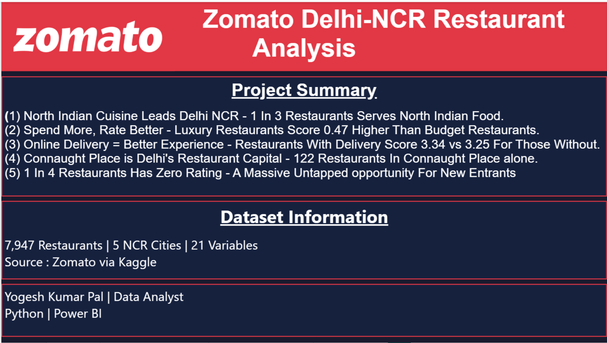
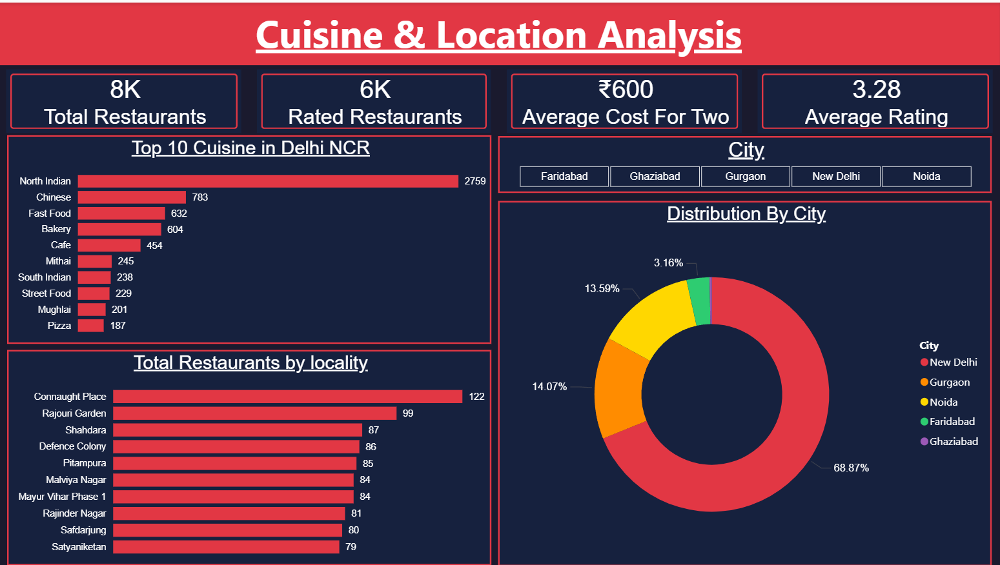
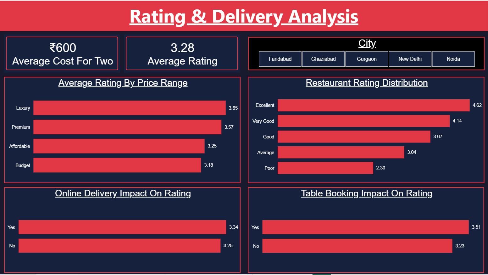
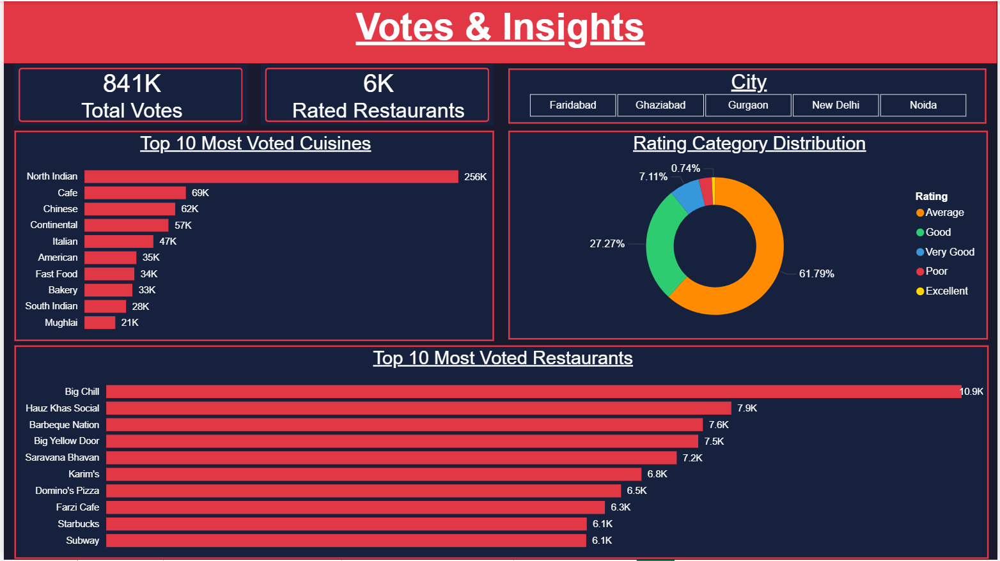

# Zomato Delhi NCR Restaurant Analysis

## Project Overview
An end-to-end data analysis project on Zomato's restaurant data for Delhi NCR 
covering 7,947 restaurants across 5 cities. The project follows a complete 
analyst workflow — data cleaning in Python, EDA with visualisations, and an 
interactive Power BI dashboard.

## Tools Used
- **Python (Pandas, Matplotlib, Seaborn)** — Data cleaning, EDA and visualisations
- **Power BI** — Interactive 4-page dashboard

## Dataset
- Source: Kaggle — Zomato Restaurants Data by Shrutimehta
- Original rows: 9,551 (global)
- After filtering India: 8,652 rows
- After filtering Delhi NCR: 7,947 restaurants
- Cities covered: New Delhi, Gurgaon, Noida, Faridabad, Ghaziabad

## Data Cleaning Steps
1. Filtered India only from the global dataset using Country Code = 1
2. Filtered Delhi NCR cities — 7,947 rows from 8,652
3. Dropped 6 irrelevant columns (Longitude, Latitude, Currency etc.)
4. Stripped whitespace from Has_Online_Delivery column
5. Separated 2,139 unrated restaurants (26.92%) for appropriate analysis
6. Extracted primary cuisine from the multi-cuisine column
7. Added price_label column mapping 1-4 to Budget/Affordable/Premium/Luxury

## Business Questions Answered
1. Which cuisines dominate Delhi NCR restaurants?
2. Which localities have the highest restaurant density?
3. Does online delivery availability affect ratings?
4. Does price range correlate with customer ratings?
5. Which restaurants and cuisines get the most votes?
6. Does table booking availability impact ratings?

## Key Findings
1. North Indian cuisine dominates — 1 in 3 restaurants serves North Indian food
2. Luxury restaurants score 0.47 higher than Budget (3.65 vs 3.18) — price and quality correlate
3. Online delivery restaurants rate higher (3.34 vs 3.25) — delivery presence signals quality
4. Connaught Place is Delhi's restaurant capital with 122 restaurants in one locality
5. 1 in 4 restaurants has zero ratings — massive untapped opportunity for new entrants
6. Big Chill leads Delhi NCR with 10,900 votes — far ahead of the competition
7. Table booking restaurants rate significantly higher (3.51 vs 3.23)

## Python Visualisations
1. Top 10 Cuisines in Delhi NCR (Bar Chart)
2. Impact of Online Delivery on Ratings (Box Plot)
3. Average Rating by Price Range (Bar Chart)
4. Top 10 Localities by Restaurant Count (Bar Chart)
5. Votes vs Rating Relationship (Scatter Plot with Trend Line)

## Dashboard Pages
### 1. Overview — Project summary and key findings

### 2. Cuisine & Location Analysis — Top cuisines, localities and city distribution

### 3. Rating & Delivery Analysis — Price range, delivery and table booking impact

### 4. Votes & Insights — Most voted restaurants, cuisines and rating distribution

## Author
**Yogesh Kumar Pal**

Data Analyst | Python | Power BI
